# Учебная практика #

#### Ход работы ####

##### ER-диаграмма БД #####

##### Описание стека #####

Были использованы библиотеки:
* mysql  
* tkinter 
* PIL 
* os 
* datetime 
* decimal 
* random

##### Работа программы #####

1. Окно входа
Окно авторизации при запуске:  
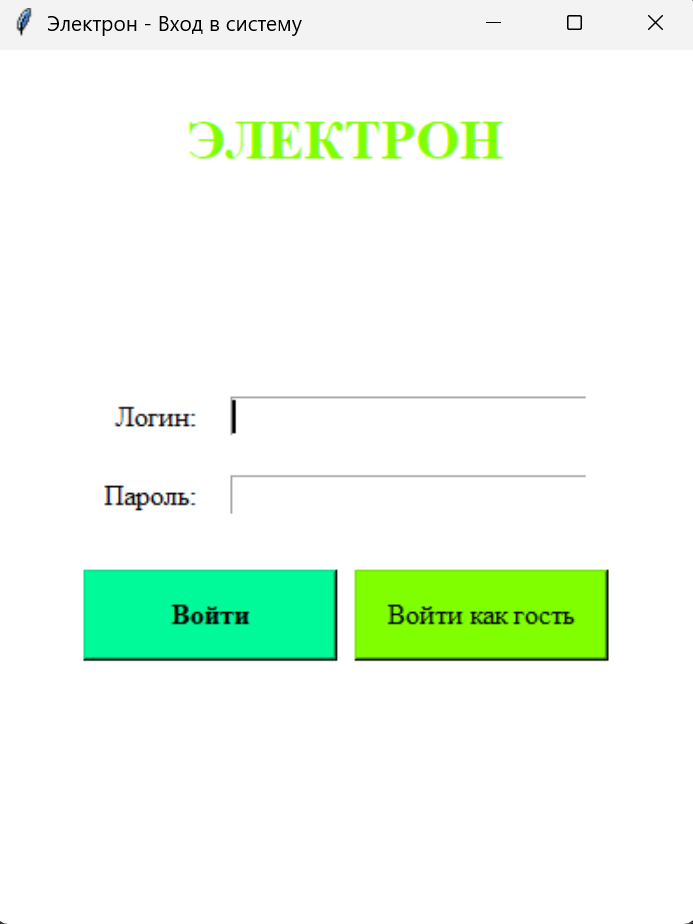  
Роли:
* Администратор:  
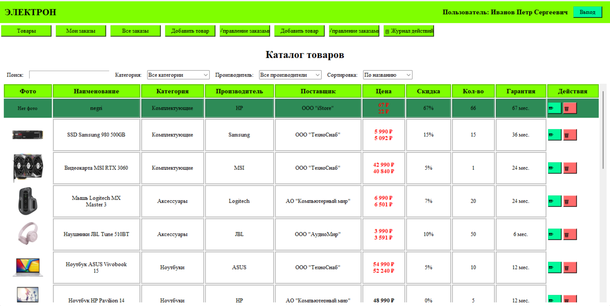  
* Менеджер:  
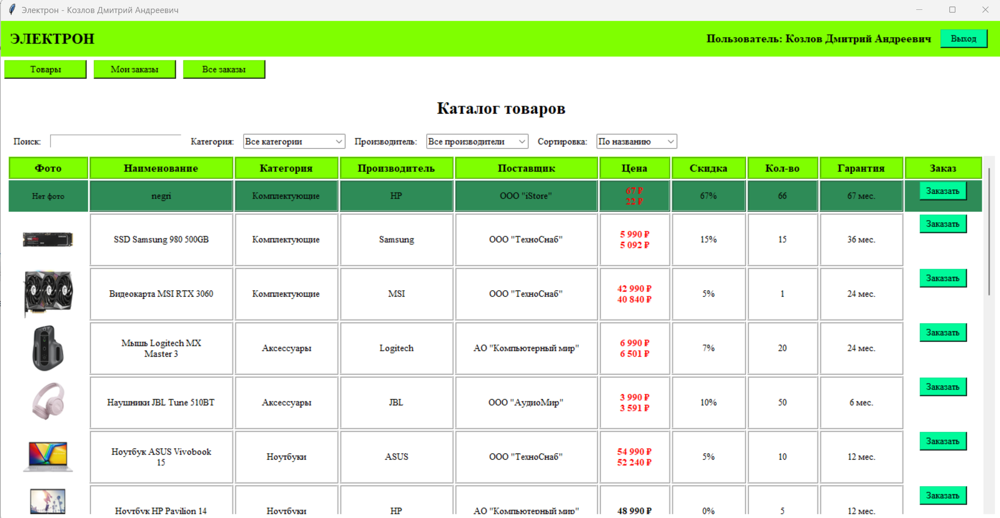  
* Авторизированный клиент:  
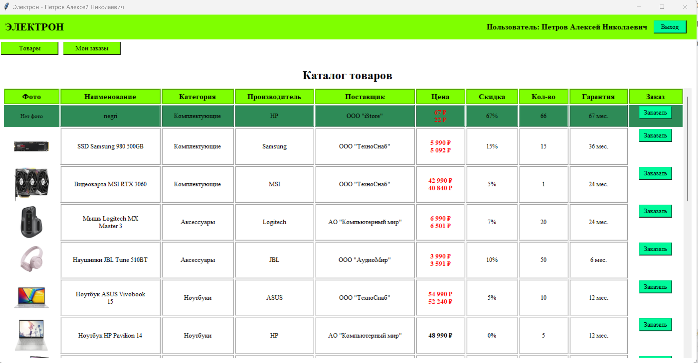  
Либо вы можете войти как гость нажав на соответствующую кнопку: 
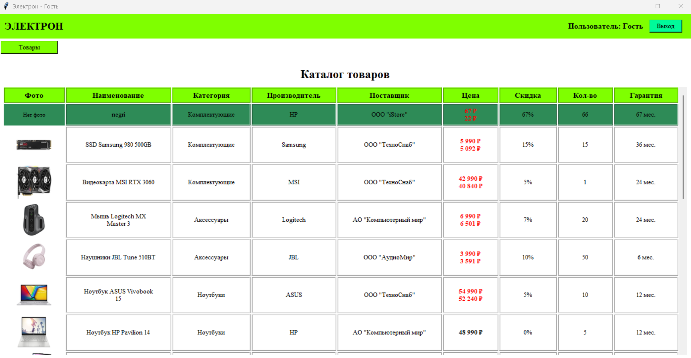  
2. Главное окно:
В главном окне есть вкладки товары со всеми товарами,вкладка мои заказы с заказами пользователя,вкладка все заказы, вкладка добавление товара,вкладка управления заказами где можно добавить,редактировать,удалить заказ и журнал действий со всеми действями пользователей

3. Вкладка товары
3.1. Основной функционал
На вкладке товары можно найти,отсортировать,редактировать и удалять товары
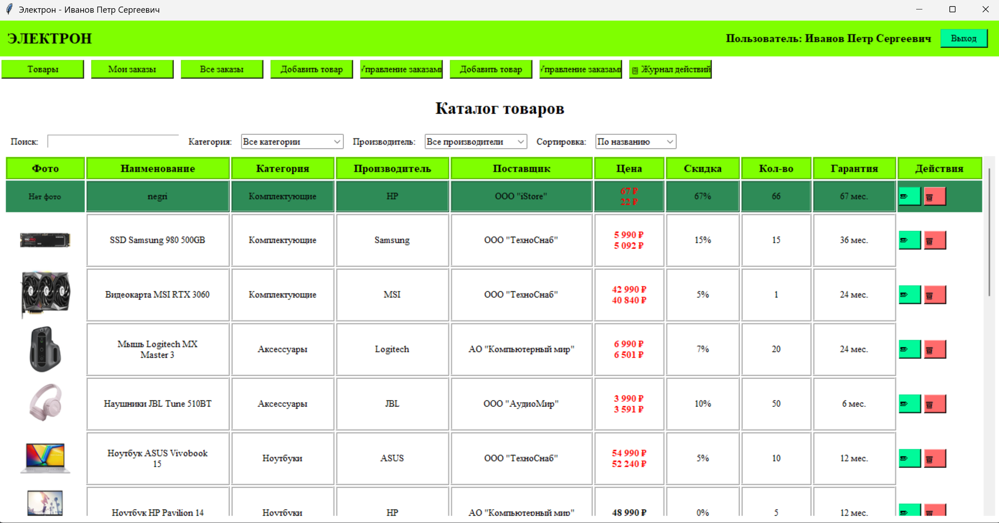  
3.2. Редактирование товара
При нажатии на соответствующую кнопку откроется окно редактирования товара:  
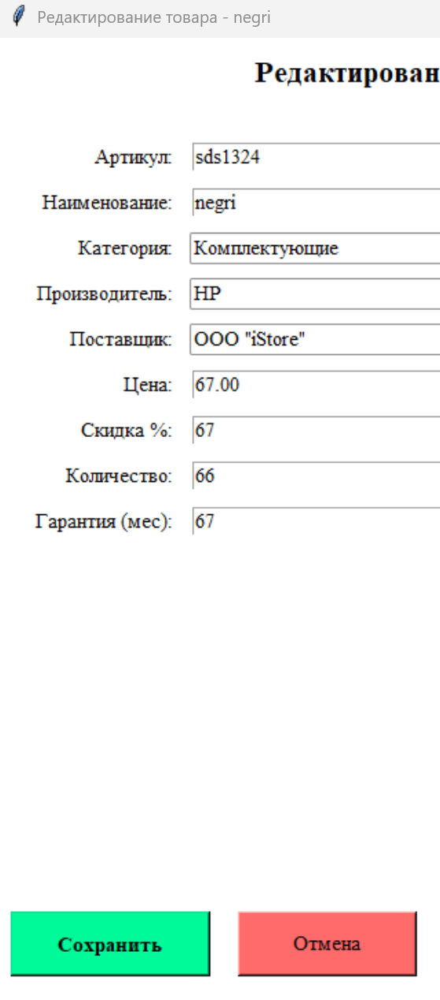  
4. Вкладка мои заказы
4.1. Основной функционал
На данной вкладке отображаются личные заказы пользователя
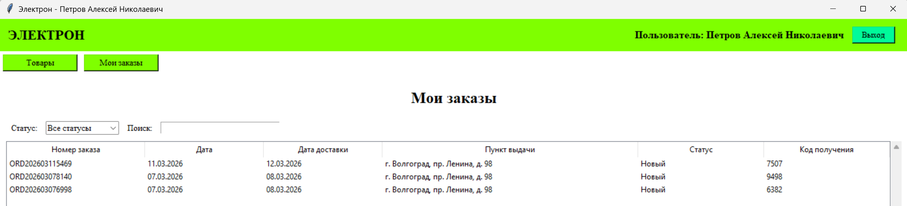  
4.2. Добавление товара
На данной вкладке реализована функция добавления товара
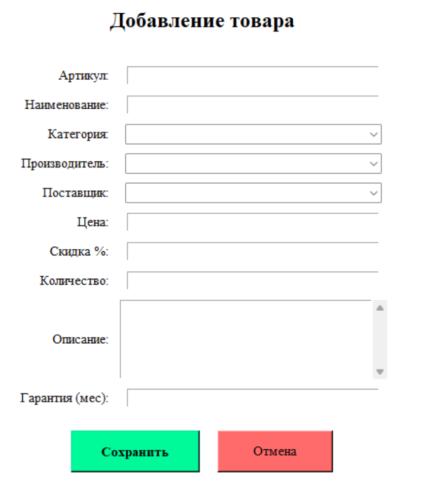  
5. Вкладка Управление заказами
Здесь можно создать,редактировать,удалить заказ
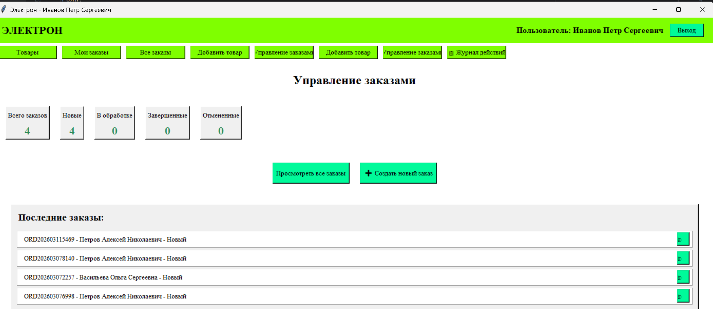
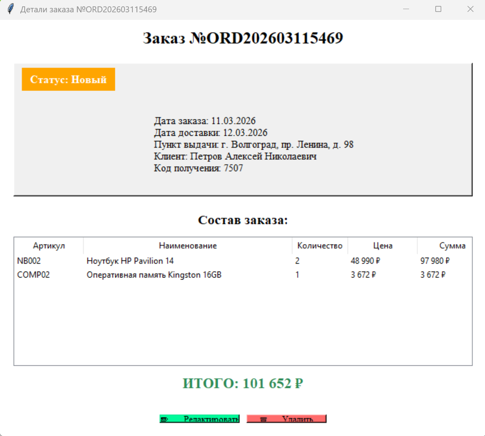
6. Вкладка Журнал действий
Здесь можно увидеть все действия по созданию/редактированию/далению товара/заказа
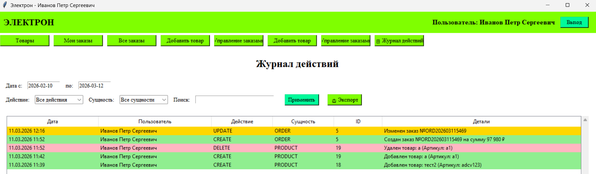