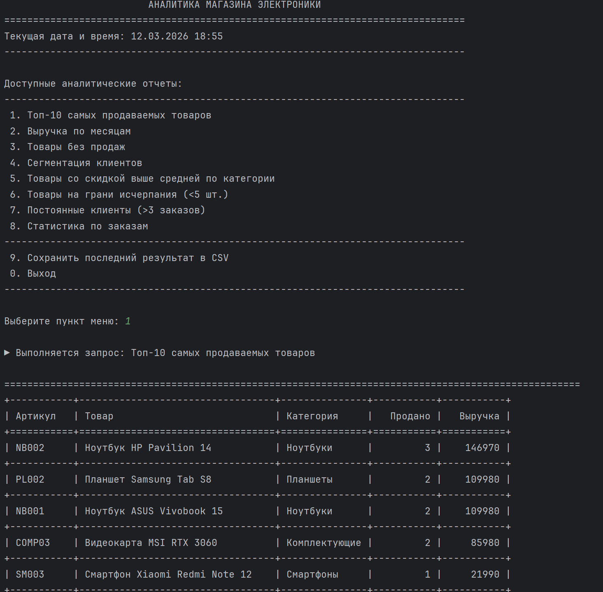
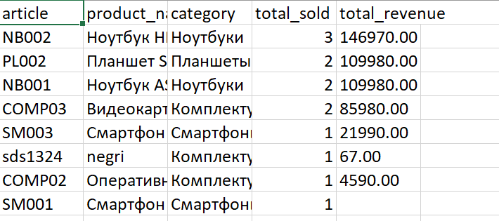

# Учебная практика #

#### Ход работы ####
##### Задание 1 #####
1. Топ 10 самых продаваемых товаров
* команда :
```sql
SELECT 
    p.article,
    p.name AS product_name,
    c.name AS category,
    SUM(oi.quantity) AS total_sold,
    SUM(oi.quantity * oi.price_at_purchase) AS total_revenue
FROM products p
JOIN categories c ON p.category_id = c.id
JOIN order_items oi ON p.id = oi.product_id
JOIN orders o ON oi.order_id = o.id
GROUP BY p.id, p.article, p.name, c.name
ORDER BY total_sold DESC
LIMIT 10;
```
* Результат:

 | article | product\_name | category | total\_sold | total\_revenue |
 | :--- | :--- | :--- | :--- | :--- |
 | NB002 | Ноутбук HP Pavilion 14 | Ноутбуки | 3 | 146970.00 |
 | COMP03 | Видеокарта MSI RTX 3060 | Комплектующие | 2 | 85980.00 |
 | PL002 | Планшет Samsung Tab S8 | Планшеты | 2 | 109980.00 |
 | NB001 | Ноутбук ASUS Vivobook 15 | Ноутбуки | 2 | 109980.00 |
 | sds1324 | negri | Комплектующие | 1 | 67.00 |
 | SM003 | Смартфон Xiaomi Redmi Note 12 | Смартфоны | 1 | 21990.00 |
 | COMP02 | Оперативная память Kingston 16GB | Комплектующие | 1 | 4590.00 |

2. Выручка по месяцам
* команда :
```sql
SELECT
    DATE_FORMAT(o.order_date, '%Y-%m') AS month,
    COUNT(DISTINCT o.id) AS orders_count,
    SUM(oi.quantity * oi.price_at_purchase) AS revenue,
    LAG(SUM(oi.quantity * oi.price_at_purchase)) OVER (ORDER BY DATE_FORMAT(o.order_date, '%Y-%m')) AS prev_month_revenue,
    CASE
        WHEN LAG(SUM(oi.quantity * oi.price_at_purchase)) OVER (ORDER BY DATE_FORMAT(o.order_date, '%Y-%m')) IS NULL THEN 0
        ELSE ROUND(((SUM(oi.quantity * oi.price_at_purchase) - LAG(SUM(oi.quantity * oi.price_at_purchase)) OVER (ORDER BY DATE_FORMAT(o.order_date, '%Y-%m'))) /
        LAG(SUM(oi.quantity * oi.price_at_purchase)) OVER (ORDER BY DATE_FORMAT(o.order_date, '%Y-%m'))) * 100, 2)
    END AS growth_percent
FROM orders o
JOIN order_items oi ON o.id = oi.order_id
GROUP BY DATE_FORMAT(o.order_date, '%Y-%m')
ORDER BY month DESC;
```
* Результат:

 | month | orders\_count | revenue | prev\_month\_revenue | growth\_percent |
 | :--- | :--- | :--- | :--- | :--- |
 | 2026-03 | 4 | 479557.00 | null | 0.00 |


3. Товары без продаж
* команда :
```sql
SELECT
    p.article,
    p.name AS product_name,
    c.name AS category,
    p.price,
    p.quantity AS stock_quantity
FROM products p
LEFT JOIN categories c ON p.category_id = c.id
LEFT JOIN order_items oi ON p.id = oi.product_id
WHERE oi.id IS NULL
ORDER BY p.name;
```
* Результат:

 | article | product\_name | category | price | stock\_quantity |
 | :--- | :--- | :--- | :--- | :--- |
 | COMP01 | SSD Samsung 980 500GB | Комплектующие | 5990.00 | 15 |
 | ACC002 | Мышь Logitech MX Master 3 | Аксессуары | 6990.00 | 20 |
 | ACC001 | Наушники JBL Tune 510BT | Аксессуары | 3990.00 | 50 |
 | NB003 | Ноутбук Lenovo IdeaPad 3 | Ноутбуки | 42990.00 | 15 |
 | fdsf13124 | паыгпвы | Комплектующие | 10000.00 | 1 |
 | PL003 | Планшет Huawei MatePad | Планшеты | 32990.00 | 0 |
 | PL001 | Планшет iPad 10 | Планшеты | 45990.00 | 7 |
 | SM002 | Смартфон iPhone 13 | Смартфоны | 65990.00 | 10 |
 | SM001 | Смартфон Samsung Galaxy A54 | Смартфоны | 32990.00 | 25 |
 | adcv123 | тест2 | Комплектующие | 1.00 | 1 |
 | ACC003 | Чехол для iPhone 13 | Аксессуары | 1990.00 | 35 |


4. Сегментация клиентов
* команда :
```sql
SELECT
    u.id,
    u.full_name,
    u.login,
    COUNT(DISTINCT o.id) AS orders_count,
    COALESCE(SUM(oi.quantity * oi.price_at_purchase), 0) AS total_spent,
    CASE
        WHEN COALESCE(SUM(oi.quantity * oi.price_at_purchase), 0) < 10000 THEN 'Эконом'
        WHEN COALESCE(SUM(oi.quantity * oi.price_at_purchase), 0) BETWEEN 10000 AND 50000 THEN 'Стандарт'
        WHEN COALESCE(SUM(oi.quantity * oi.price_at_purchase), 0) BETWEEN 50000 AND 150000 THEN 'Премиум'
        WHEN COALESCE(SUM(oi.quantity * oi.price_at_purchase), 0) > 150000 THEN 'VIP'
        ELSE 'Нет покупок'
    END AS segment
FROM users u
LEFT JOIN orders o ON u.id = o.user_id
LEFT JOIN order_items oi ON o.id = oi.order_id
WHERE u.role_id = 3 -- только клиенты
GROUP BY u.id, u.full_name, u.login
ORDER BY total_spent DESC;

```
* Результат:

 | id | full\_name | login | orders\_count | total\_spent | segment |
 | :--- | :--- | :--- | :--- | :--- | :--- |
 | 5 | Петров Алексей Николаевич | a.petrov@mail.ru | 3 | 347587.00 | VIP |
 | 6 | Васильева Ольга Сергеевна | o.vasilyeva@yandex.ru | 1 | 131970.00 | Премиум |
 | 7 | Николаев Павел Викторович | p.nikolaev@gmail.com | 0 | 0.00 | Эконом |
 | 8 | Морозова Татьяна Ильинична | t.morozova@bk.ru | 0 | 0.00 | Эконом |
 | 9 | Степанов Игорь Валерьевич | i.stepanov@outlook.com | 0 | 0.00 | Эконом |
 | 10 | Федорова Наталья Петровна | n.fedorova@mail.ru | 0 | 0.00 | Эконом |


5. Товары со скидкой выше средней
* команда :
```sql
WITH category_avg_discount AS (
    SELECT
        category_id,
        AVG(discount) AS avg_discount
    FROM products
    GROUP BY category_id
)
SELECT
    p.article,
    p.name AS product_name,
    c.name AS category,
    p.discount AS product_discount,
    ROUND(cad.avg_discount, 2) AS category_avg_discount,
    ROUND(p.discount - cad.avg_discount, 2) AS difference
FROM products p
JOIN categories c ON p.category_id = c.id
JOIN category_avg_discount cad ON p.category_id = cad.category_id
WHERE p.discount > cad.avg_discount
ORDER BY difference DESC;
```
* Результат:

 | article | product\_name | category | product\_discount | category\_avg\_discount | difference |
 | :--- | :--- | :--- | :--- | :--- | :--- |
 | sds1324 | negri | Комплектующие | 67 | 18.83 | 48.17 |
 | PL003 | Планшет Huawei MatePad | Планшеты | 20 | 12.33 | 7.67 |
 | SM003 | Смартфон Xiaomi Redmi Note 12 | Смартфоны | 15 | 8.67 | 6.33 |
 | NB003 | Ноутбук Lenovo IdeaPad 3 | Ноутбуки | 10 | 5.00 | 5.00 |
 | ACC001 | Наушники JBL Tune 510BT | Аксессуары | 10 | 5.67 | 4.33 |
 | ACC002 | Мышь Logitech MX Master 3 | Аксессуары | 7 | 5.67 | 1.33 |
 | COMP02 | Оперативная память Kingston 16GB | Комплектующие | 20 | 18.83 | 1.17 |


6. Товары на грани исчерпания
* команда :
```sql
SELECT
    p.article,
    p.name AS product_name,
    c.name AS category,
    p.quantity AS stock_quantity,
    p.price,
    CASE
        WHEN p.quantity = 0 THEN 'Нет в наличии'
        WHEN p.quantity < 3 THEN 'Критически мало'
        ELSE 'Мало'
    END AS status
FROM products p
JOIN categories c ON p.category_id = c.id
WHERE p.quantity < 5
ORDER BY p.quantity;
```
* Результат:

 | article | product\_name | category | stock\_quantity | price | status |
 | :--- | :--- | :--- | :--- | :--- | :--- |
 | PL003 | Планшет Huawei MatePad | Планшеты | 0 | 32990.00 | Нет в наличии |
 | COMP03 | Видеокарта MSI RTX 3060 | Комплектующие | 1 | 42990.00 | Критически мало |
 | fdsf13124 | паыгпвы | Комплектующие | 1 | 10000.00 | Критически мало |
 | adcv123 | тест2 | Комплектующие | 1 | 1.00 | Критически мало |
 | PL002 | Планшет Samsung Tab S8 | Планшеты | 3 | 54990.00 | Мало |


7. Постоянные клиенты
* команда :
```sql
SELECT
    u.id,
    u.full_name,
    u.login,
    COUNT(DISTINCT o.id) AS orders_count,
    COALESCE(SUM(oi.quantity * oi.price_at_purchase), 0) AS total_spent,
    ROUND(COALESCE(SUM(oi.quantity * oi.price_at_purchase), 0) / COUNT(DISTINCT o.id), 2) AS avg_order_value,
    MAX(o.order_date) AS last_order_date
FROM users u
JOIN orders o ON u.id = o.user_id
LEFT JOIN order_items oi ON o.id = oi.order_id
WHERE u.role_id = 3 -- только клиенты
GROUP BY u.id, u.full_name, u.login
HAVING COUNT(DISTINCT o.id) > 3
ORDER BY orders_count DESC, total_spent DESC;
```
* Результат:

 | id | full\_name | login | orders\_count | total\_spent | avg\_order\_value | last\_order\_date |
 | :--- | :--- | :--- | :--- | :--- | :--- | :--- |
 | 5 | Петров Алексей Николаевич | a.petrov@mail.ru | 4 | 347587.00 | 86896.75 | 2026-03-12 |

8. Статистика заказам
* команда :
```sql
SELECT
    o.status,
    COUNT(*) AS orders_count,
    SUM(oi.quantity) AS total_items,
    COALESCE(SUM(oi.quantity * oi.price_at_purchase), 0) AS total_revenue,
    ROUND(AVG(oi.quantity * oi.price_at_purchase), 2) AS avg_order_value,
    MIN(o.order_date) AS first_order,
    MAX(o.order_date) AS last_order,
    COUNT(DISTINCT o.user_id) AS unique_customers
FROM orders o
LEFT JOIN order_items oi ON o.id = oi.order_id
GROUP BY o.status
ORDER BY
    CASE o.status
        WHEN 'Новый' THEN 1
        WHEN 'В обработке' THEN 2
        WHEN 'Завершен' THEN 3
        WHEN 'Отменен' THEN 4
        ELSE 5
    END;
```
* Результат:

 | status | orders\_count | total\_items | total\_revenue | avg\_order\_value | first\_order | last\_order | unique\_customers |
 | :--- | :--- | :--- | :--- | :--- | :--- | :--- | :--- |
 | Новый | 9 | 13 | 479557.00 | 59944.63 | 2026-03-07 | 2026-03-12 | 2 |

##### Задание 2 #####
1. Написать консольную программу, выводящие запросы ниже, записывая логи и сохраняющая в формате cvs последний результат
* Команда

```Python

import mysql.connector
from mysql.connector import Error
import os
from datetime import datetime
import csv
import logging
from tabulate import tabulate
import sys

# Настройка логирования
LOG_FILE = 'query_history.log'
logging.basicConfig(
    filename=LOG_FILE,
    level=logging.INFO,
    format='%(asctime)s - %(message)s',
    datefmt='%Y-%m-%d %H:%M:%S'
)


class Database:
    def __init__(self):
        self.connection = None
        self.connect()

    def connect(self):
        try:
            self.connection = mysql.connector.connect(
                host='localhost',
                database='electron_shop',
                user='root1',  # замените на вашего пользователя
                password='12345',  # замените на ваш пароль
                use_pure=True
            )
            print("✓ Подключение к базе данных успешно")
        except Error as e:
            print(f"✗ Ошибка подключения к БД: {e}")
            sys.exit(1)

    def execute_query(self, query, params=None):
        """Выполнение SQL запроса и возврат результатов"""
        cursor = self.connection.cursor(dictionary=True)
        try:
            cursor.execute(query, params or ())
            return cursor.fetchall()
        except Error as e:
            print(f"✗ Ошибка выполнения запроса: {e}")
            return []
        finally:
            cursor.close()


class AnalyticsCLI:
    def __init__(self):
        self.db = Database()
        self.current_results = None
        self.current_query_name = None
        self.queries = {
            '1': {
                'name': 'Топ-10 самых продаваемых товаров',
                'query': """
                    SELECT 
                        p.article,
                        p.name AS product_name,
                        c.name AS category,
                        SUM(oi.quantity) AS total_sold,
                        SUM(oi.quantity * oi.price_at_purchase) AS total_revenue
                    FROM products p
                    JOIN categories c ON p.category_id = c.id
                    JOIN order_items oi ON p.id = oi.product_id
                    JOIN orders o ON oi.order_id = o.id
                    GROUP BY p.id, p.article, p.name, c.name
                    ORDER BY total_sold DESC
                    LIMIT 10;
                """,
                'headers': ['Артикул', 'Товар', 'Категория', 'Продано', 'Выручка']
            },
            '2': {
                'name': 'Выручка по месяцам',
                'query': """
                    SELECT 
                        DATE_FORMAT(o.order_date, '%Y-%m') AS month,
                        COUNT(DISTINCT o.id) AS orders_count,
                        SUM(oi.quantity * oi.price_at_purchase) AS revenue,
                        LAG(SUM(oi.quantity * oi.price_at_purchase)) OVER (ORDER BY DATE_FORMAT(o.order_date, '%Y-%m')) AS prev_month_revenue,
                        CASE 
                            WHEN LAG(SUM(oi.quantity * oi.price_at_purchase)) OVER (ORDER BY DATE_FORMAT(o.order_date, '%Y-%m')) IS NULL THEN 0
                            ELSE ROUND(((SUM(oi.quantity * oi.price_at_purchase) - LAG(SUM(oi.quantity * oi.price_at_purchase)) OVER (ORDER BY DATE_FORMAT(o.order_date, '%Y-%m'))) / 
                            LAG(SUM(oi.quantity * oi.price_at_purchase)) OVER (ORDER BY DATE_FORMAT(o.order_date, '%Y-%m'))) * 100, 2)
                        END AS growth_percent
                    FROM orders o
                    JOIN order_items oi ON o.id = oi.order_id
                    GROUP BY DATE_FORMAT(o.order_date, '%Y-%m')
                    ORDER BY month DESC;
                """,
                'headers': ['Месяц', 'Заказов', 'Выручка', 'Выручка (пред)', 'Рост (%)']
            },
            '3': {
                'name': 'Товары без продаж',
                'query': """
                    SELECT 
                        p.article,
                        p.name AS product_name,
                        c.name AS category,
                        p.price,
                        p.quantity AS stock_quantity
                    FROM products p
                    LEFT JOIN categories c ON p.category_id = c.id
                    LEFT JOIN order_items oi ON p.id = oi.product_id
                    WHERE oi.id IS NULL
                    ORDER BY p.name;
                """,
                'headers': ['Артикул', 'Товар', 'Категория', 'Цена', 'Остаток']
            },
            '4': {
                'name': 'Сегментация клиентов',
                'query': """
                    SELECT 
                        u.id,
                        u.full_name,
                        u.login,
                        COUNT(DISTINCT o.id) AS orders_count,
                        COALESCE(SUM(oi.quantity * oi.price_at_purchase), 0) AS total_spent,
                        CASE 
                            WHEN COALESCE(SUM(oi.quantity * oi.price_at_purchase), 0) < 10000 THEN 'Эконом'
                            WHEN COALESCE(SUM(oi.quantity * oi.price_at_purchase), 0) BETWEEN 10000 AND 50000 THEN 'Стандарт'
                            WHEN COALESCE(SUM(oi.quantity * oi.price_at_purchase), 0) BETWEEN 50000 AND 150000 THEN 'Премиум'
                            WHEN COALESCE(SUM(oi.quantity * oi.price_at_purchase), 0) > 150000 THEN 'VIP'
                            ELSE 'Нет покупок'
                        END AS segment
                    FROM users u
                    LEFT JOIN orders o ON u.id = o.user_id
                    LEFT JOIN order_items oi ON o.id = oi.order_id
                    WHERE u.role_id = 3
                    GROUP BY u.id, u.full_name, u.login
                    ORDER BY total_spent DESC;
                """,
                'headers': ['ID', 'ФИО', 'Логин', 'Заказов', 'Сумма', 'Сегмент']
            },
            '5': {
                'name': 'Товары со скидкой выше средней по категории',
                'query': """
                    WITH category_avg_discount AS (
                        SELECT 
                            category_id,
                            AVG(discount) AS avg_discount
                        FROM products
                        GROUP BY category_id
                    )
                    SELECT 
                        p.article,
                        p.name AS product_name,
                        c.name AS category,
                        p.discount AS product_discount,
                        ROUND(cad.avg_discount, 2) AS category_avg_discount,
                        ROUND(p.discount - cad.avg_discount, 2) AS difference
                    FROM products p
                    JOIN categories c ON p.category_id = c.id
                    JOIN category_avg_discount cad ON p.category_id = cad.category_id
                    WHERE p.discount > cad.avg_discount
                    ORDER BY difference DESC;
                """,
                'headers': ['Артикул', 'Товар', 'Категория', 'Скидка %', 'Ср. по кат.', 'Разница']
            },
            '6': {
                'name': 'Товары на грани исчерпания',
                'query': """
                    SELECT 
                        p.article,
                        p.name AS product_name,
                        c.name AS category,
                        p.quantity AS stock_quantity,
                        p.price,
                        CASE 
                            WHEN p.quantity = 0 THEN 'Нет в наличии'
                            WHEN p.quantity < 3 THEN 'Критически мало'
                            ELSE 'Мало'
                        END AS status
                    FROM products p
                    JOIN categories c ON p.category_id = c.id
                    WHERE p.quantity < 5
                    ORDER BY p.quantity;
                """,
                'headers': ['Артикул', 'Товар', 'Категория', 'Остаток', 'Цена', 'Статус']
            },
            '7': {
                'name': 'Постоянные клиенты',
                'query': """
                    SELECT 
                        u.id,
                        u.full_name,
                        u.login,
                        COUNT(DISTINCT o.id) AS orders_count,
                        COALESCE(SUM(oi.quantity * oi.price_at_purchase), 0) AS total_spent,
                        ROUND(COALESCE(SUM(oi.quantity * oi.price_at_purchase), 0) / COUNT(DISTINCT o.id), 2) AS avg_order_value,
                        MAX(o.order_date) AS last_order_date
                    FROM users u
                    JOIN orders o ON u.id = o.user_id
                    LEFT JOIN order_items oi ON o.id = oi.order_id
                    WHERE u.role_id = 3
                    GROUP BY u.id, u.full_name, u.login
                    HAVING COUNT(DISTINCT o.id) > 3
                    ORDER BY orders_count DESC, total_spent DESC;
                """,
                'headers': ['ID', 'ФИО', 'Логин', 'Заказов', 'Сумма', 'Ср. чек', 'Последний заказ']
            },
            '8': {
                'name': 'Статистика по заказам',
                'query': """
                    SELECT 
                        o.status,
                        COUNT(*) AS orders_count,
                        SUM(oi.quantity) AS total_items,
                        COALESCE(SUM(oi.quantity * oi.price_at_purchase), 0) AS total_revenue,
                        ROUND(AVG(oi.quantity * oi.price_at_purchase), 2) AS avg_order_value,
                        MIN(o.order_date) AS first_order,
                        MAX(o.order_date) AS last_order,
                        COUNT(DISTINCT o.user_id) AS unique_customers
                    FROM orders o
                    LEFT JOIN order_items oi ON o.id = oi.order_id
                    GROUP BY o.status
                    ORDER BY 
                        CASE o.status
                            WHEN 'Новый' THEN 1
                            WHEN 'В обработке' THEN 2
                            WHEN 'Завершен' THEN 3
                            WHEN 'Отменен' THEN 4
                            ELSE 5
                        END;
                """,
                'headers': ['Статус', 'Заказов', 'Товаров', 'Выручка', 'Ср. чек', 'Первый', 'Последний', 'Клиентов']
            }
        }

    def clear_screen(self):
        """Очистка экрана"""
        os.system('cls' if os.name == 'nt' else 'clear')

    def print_header(self):
        """Вывод заголовка"""
        print("=" * 80)
        print(" " * 25 + "АНАЛИТИКА МАГАЗИНА ЭЛЕКТРОНИКИ")
        print("=" * 80)
        print(f"Текущая дата и время: {datetime.now().strftime('%d.%m.%Y %H:%M')}")
        print("-" * 80)

    def print_menu(self):
        """Вывод меню"""
        print("\nДоступные аналитические отчеты:")
        print("-" * 80)
        print(" 1. Топ-10 самых продаваемых товаров")
        print(" 2. Выручка по месяцам")
        print(" 3. Товары без продаж")
        print(" 4. Сегментация клиентов")
        print(" 5. Товары со скидкой выше средней по категории")
        print(" 6. Товары на грани исчерпания (<5 шт.)")
        print(" 7. Постоянные клиенты (>3 заказов)")
        print(" 8. Статистика по заказам")
        print("-" * 80)
        print(" 9. Сохранить последний результат в CSV")
        print(" 0. Выход")
        print("-" * 80)

    def format_number(self, value):
        """Форматирование чисел"""
        if isinstance(value, (int, float)):
            if value > 1000000:
                return f"{value / 1000000:.2f} млн"
            elif value > 1000:
                return f"{value:,.0f}".replace(',', ' ')
            return f"{value:,.0f}".replace(',', ' ')
        return value

    def format_currency(self, value):
        """Форматирование валюты"""
        if isinstance(value, (int, float)):
            return f"{self.format_number(value)} ₽"
        return value

    def display_results(self, results, headers):
        """Отображение результатов в виде таблицы"""
        if not results:
            print("\n✗ Нет данных для отображения")
            return False

        # Подготавливаем данные для отображения
        table_data = []
        for row in results:
            row_data = []
            for key in row.keys():
                value = row[key]
                if 'price' in key.lower() or 'revenue' in key.lower() or 'spent' in key.lower() or 'value' in key.lower():
                    value = self.format_currency(value)
                elif isinstance(value, (int, float)):
                    value = self.format_number(value)
                elif isinstance(value, datetime):
                    value = value.strftime('%d.%m.%Y')
                elif value is None:
                    value = '-'
                row_data.append(value)
            table_data.append(row_data)

        print("\n" + "=" * 100)
        print(tabulate(table_data, headers=headers, tablefmt='grid', stralign='left'))
        print("=" * 100)
        print(f"Всего записей: {len(results)}")
        return True

    def save_to_csv(self, results, filename):
        """Сохранение результатов в CSV"""
        if not results:
            print("✗ Нет данных для сохранения")
            return False

        # Создаем директорию reports, если её нет
        if not os.path.exists('reports'):
            os.makedirs('reports')

        filepath = os.path.join('reports', filename)

        try:
            with open(filepath, 'w', newline='', encoding='utf-8-sig') as csvfile:
                if results:
                    writer = csv.DictWriter(csvfile, fieldnames=results[0].keys(), delimiter=';')
                    writer.writeheader()
                    writer.writerows(results)

            print(f"✓ Результаты сохранены в файл: {filepath}")
            return True
        except Exception as e:
            print(f"✗ Ошибка при сохранении: {e}")
            return False

    def log_query(self, query_name):
        """Логирование выполненного запроса"""
        logging.info(f"Выполнен запрос: {query_name}")

    def run_query(self, choice):
        """Выполнение выбранного запроса"""
        query_info = self.queries.get(choice)
        if not query_info:
            return False

        print(f"\n▶ Выполняется запрос: {query_info['name']}")

        results = self.db.execute_query(query_info['query'])

        if results is not None:
            self.current_results = results
            self.current_query_name = query_info['name']

            # Отображаем результаты
            self.display_results(results, query_info['headers'])

            # Логируем
            self.log_query(query_info['name'])

            return True
        return False

    def save_current_results(self):
        """Сохранение текущих результатов в CSV"""
        if self.current_results is None or self.current_query_name is None:
            print("\n✗ Нет результатов для сохранения. Сначала выполните запрос.")
            return

        timestamp = datetime.now().strftime('%Y%m%d_%H%M%S')
        filename = f"{self.current_query_name.replace(' ', '_')}_{timestamp}.csv"

        if self.save_to_csv(self.current_results, filename):
            print(f"\n✓ Результаты сохранены")

    def run(self):
        """Основной цикл программы"""
        while True:
            self.clear_screen()
            self.print_header()
            self.print_menu()

            choice = input("\nВыберите пункт меню: ").strip()

            if choice == '0':
                print("\n👋 До свидания!")
                break
            elif choice == '9':
                self.save_current_results()
                input("\nНажмите Enter для продолжения...")
            elif choice in self.queries:
                self.run_query(choice)
                input("\nНажмите Enter для продолжения...")
            else:
                print("\n✗ Неверный выбор. Попробуйте снова.")
                input("\nНажмите Enter для продолжения...")


def main():
    try:
        app = AnalyticsCLI()
        app.run()
    except KeyboardInterrupt:
        print("\n\n👋 Программа прервана пользователем")
    except Exception as e:
        print(f"\n✗ Критическая ошибка: {e}")


if __name__ == "__main__":
    main()
```

* Результат работы программы:

  1. Вывод запроса
  
  

  2. Сохранение файла
  
  
